# BestTrade - Taiwan Stock Market Analysis & Visualization Platform

<p align="center">
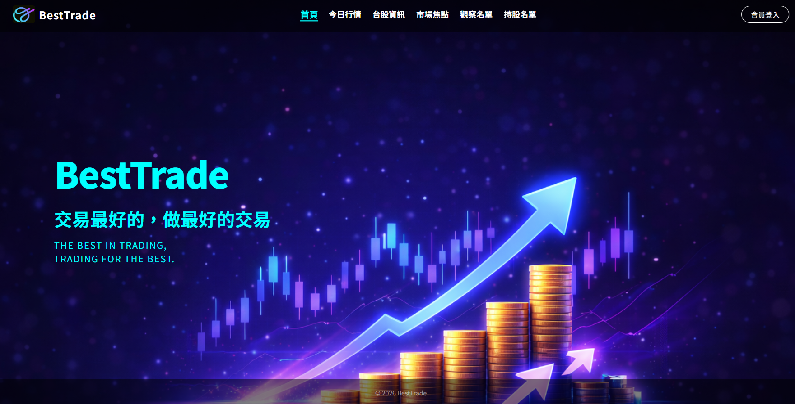
</p>

#### link: Website URL: https://1122stock.com/

#### :man:Test Account

|    -     |       -       |
| :------: | :-----------: |
| Account  | test@test.com |
| Password |     1122      |

**BestTrade** is a high-performance financial dashboard designed to provide real-time tracking and in-depth analysis of the Taiwan stock market. Built with a focus on backend scalability, the platform manages **5M+ historical records** and automates the collection of daily market data to empower investors with actionable insights.

---

## 🚀 Key Features

* **Massive Data Management**: Optimized MySQL schema and indexing to handle over 5 million historical stock records with low latency.
* **Automated ETL Pipeline**: Daily post-market data collection from TWSE and TPEx using automated scraping scripts.
* **High-Efficiency Caching**: Implemented Redis caching to accelerate data retrieval and significantly reduce primary database load.
* **Production-Ready Deployment**: Containerized orchestration using Docker Compose and Nginx, deployed on AWS EC2.
* **Real-time Portfolio Tracking**: Personalized member system featuring instant P&L (Profit & Loss) calculations.
* **CI/CD Pipeline**: Automated deployment workflow using **GitHub Actions** to streamline updates to AWS EC2.

---

## 🛠 Tech Stack

### **Back-end**
* **Language**: Python
* **Framework**: FastAPI
* **Cache**: Redis

### **Database**
* **Primary Database**: MySQL (AWS RDS)

### **DevOps & Infrastructure**
* **CI/CD**: GitHub Actions
* **Deployment**: Docker, Docker Compose
* **Web Server**: Nginx (Reverse Proxy)
* **Cloud Hosting**: AWS (EC2)

---

## 🏗 System Architecture & Design

### 1. Database Schema (ERD) & Optimization

<p align="center">
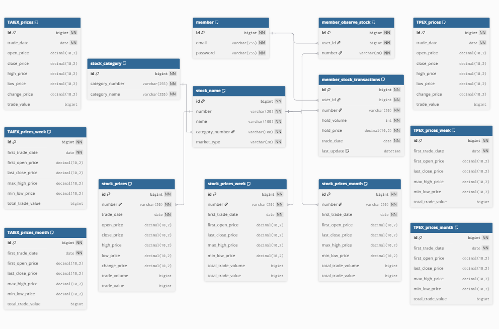
</p>

* **Schema Design**: Optimized relational schema designed for historical price storage, user portfolios, and observation lists.
* **Database Optimization**:
    * **Indexing**: Implemented B-Tree indexing on `stock_code` and `trade_date` to reduce query response time for historical data (5M+ records).
    * **Connection Pooling**: Utilized connection pooling to manage high-concurrency database access efficiently, reducing connection overhead.

### 2. Data Pipeline Workflow

<p align="center">
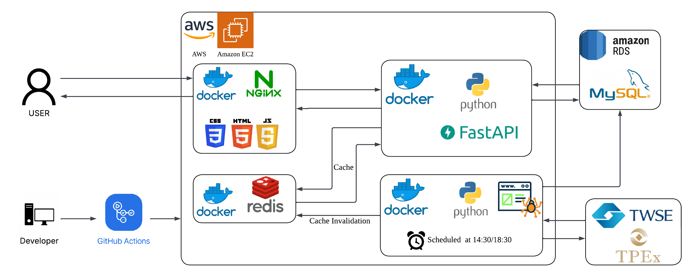
</p>

* Description: Cron Job → Web Scraper → Data Cleaning → MySQL/Redis Update.

### 3. CI/CD Workflow (GitHub Actions)
<p align="center">
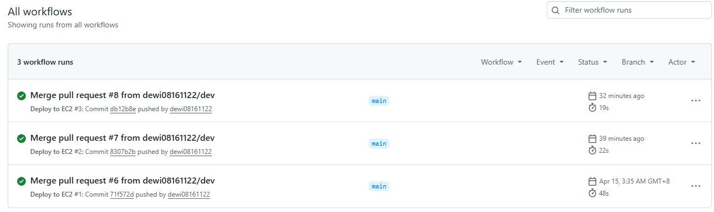
</p>

The project implements a full CI/CD pipeline to ensure seamless and reliable updates:
* **Continuous Integration**: Automatically builds Docker images and runs environment checks upon merging to the `main` branch.
* **Continuous Deployment**: Automated deployment to **AWS EC2** via SSH, ensuring the production environment stays synchronized with the latest code changes.

### 4. API Documentation

<p align="center">
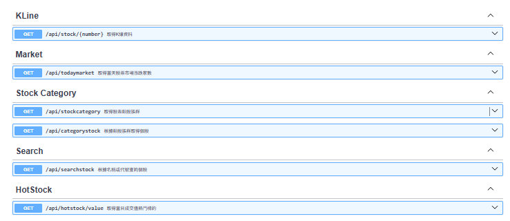
</p>

#### **📈 Stock & Market Data**
* `GET /api/stock/{number}` - Retrieve K-line data.
* `GET /api/todaymarket` - Retrieve today's stock market bull/bear statistics.
* `GET /api/stockcategory` - Retrieve stock category groups.
* `GET /api/categorystock` - Retrieve individual stocks based on category groups.
* `GET /api/searchstock` - Search for individual stocks by name or symbol.
* `GET /api/hotstock/value` - Retrieve top stocks by trading value.
<p align="center">
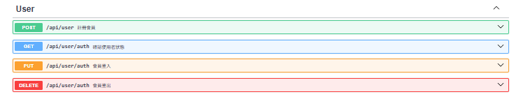
</p>

#### **👤 User Authentication**
* `POST /api/user` - User registration.
* `GET /api/user/auth` - Confirm current user authentication status.
* `PUT /api/user/auth` - User login.
* `DELETE /api/user/auth` - User logout.

<p align="center">
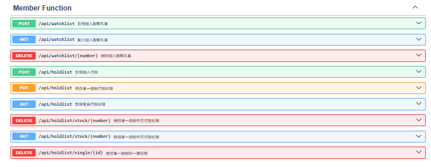
</p>

#### **📋 Member Functions (Portfolio & Watchlist)**
* `POST /api/watchlist` - Add to personal watchlist.
* `GET /api/watchlist` - Retrieve personal watchlist.
* `DELETE /api/watchlist/{number}` - Remove from personal watchlist.
* `POST /api/holdlist` - Add personal stock holdings.
* `PUT /api/holdlist` - Update a single stock holding record.
* `GET /api/holdlist` - Retrieve member stock holding records.
* `DELETE /api/holdlist/stock/{number}` - Delete all holding records for a single stock.
* `GET /api/holdlist/stock/{number}` - Retrieve all holding records for a single stock.
* `DELETE /api/holdlist/single/{id}` - Delete a specific individual holding record.
---

## 📸 Feature Demo

### **A. Interactive Stock Charts**
<p align="center">
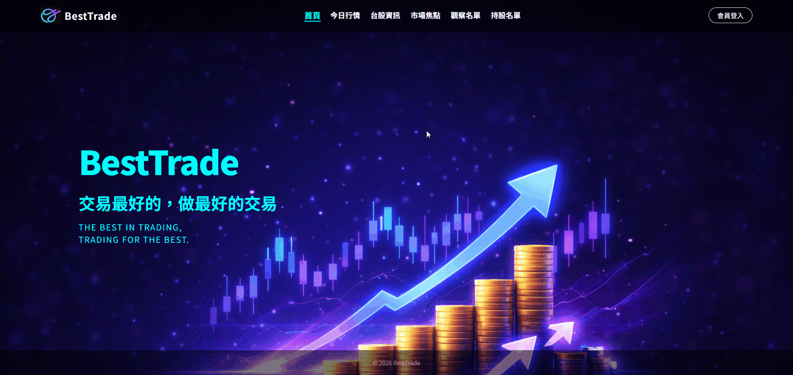
</p>
<p align="center">
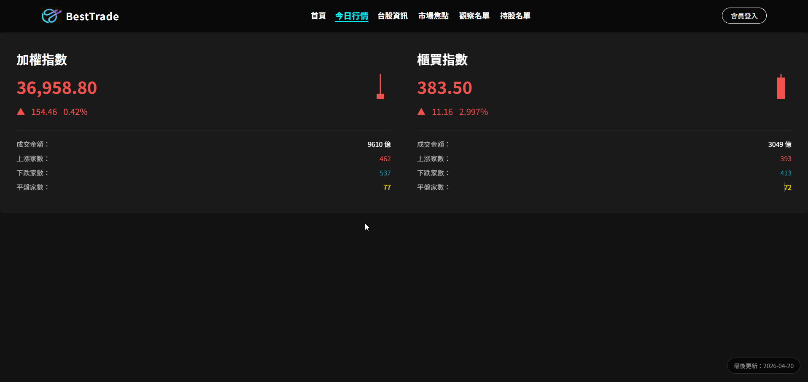
</p>
<p align="center">
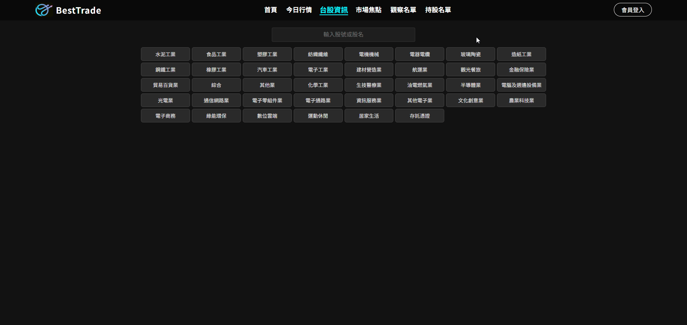
</p>
<p align="center">
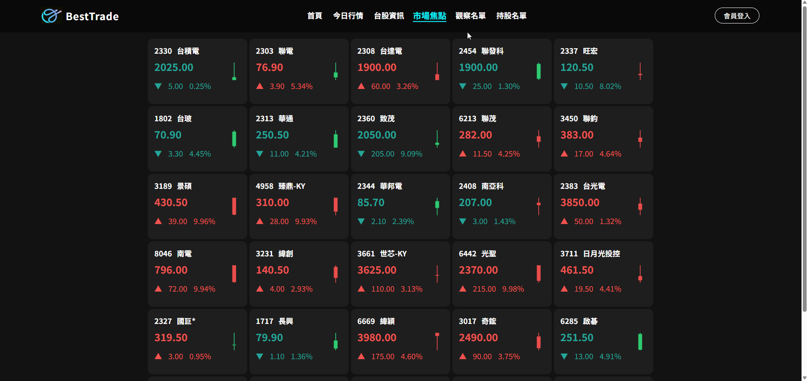
</p>
<p align="center">
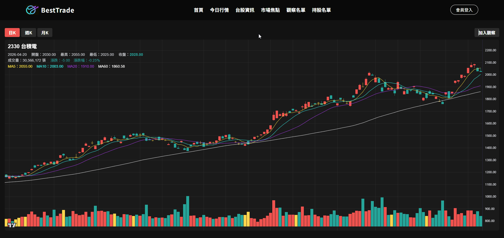
</p>
<p align="center">
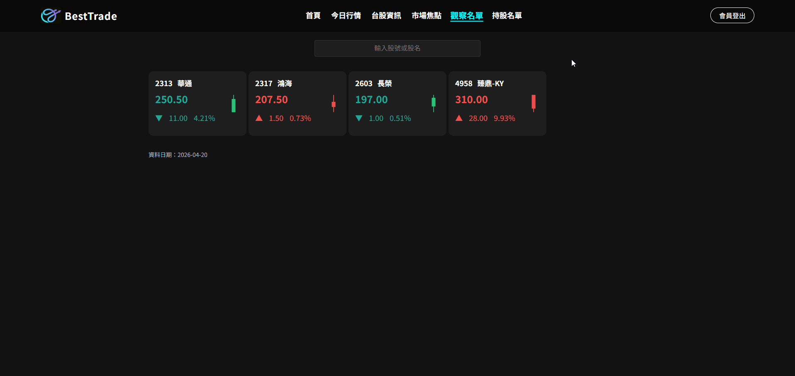
</p>
<p align="center">
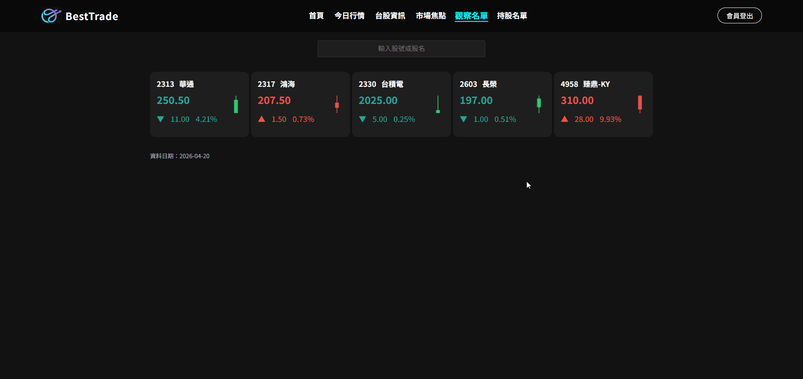
</p>

* Seamlessly visualize historical trends and technical indicators.

### **B. Portfolio & P&L Management**

<p align="center">
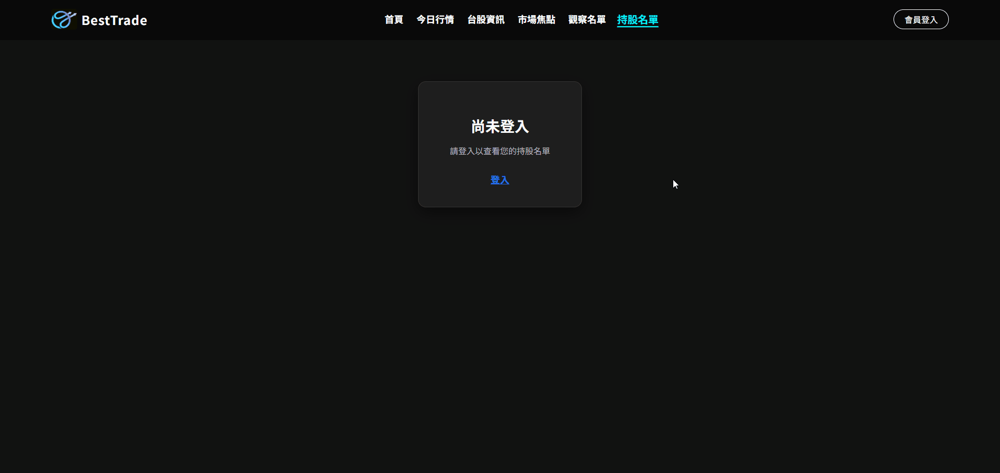
</p>
<p align="center">
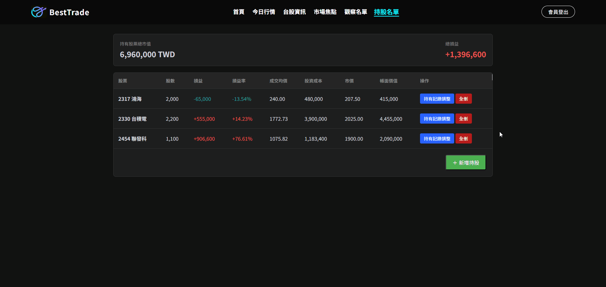
</p>
<p align="center">

</p>
<p align="center">
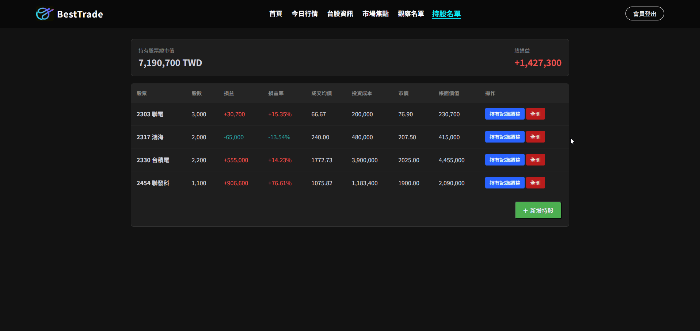
</p>

* Track investments with automated profit and loss calculations.
### **C. Automated Backend Updates & Cache Synchronization**
<p align="center">
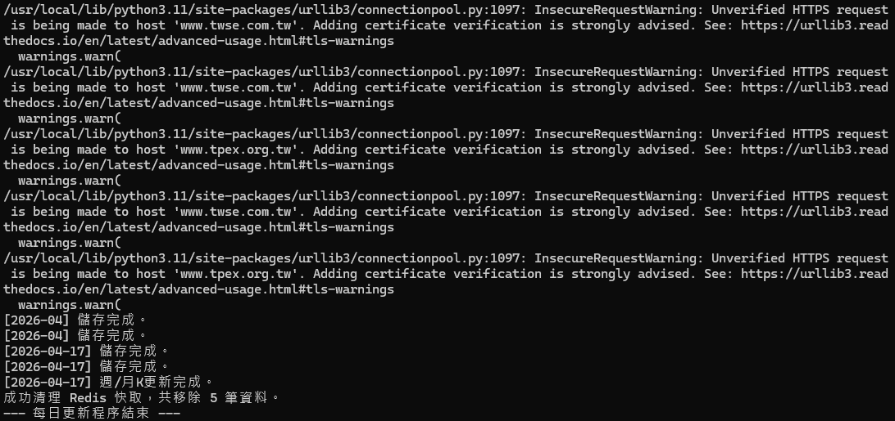
</p>

* **Daily Automated Updates**: Scheduled scrapers fetch the latest data from TWSE and TPEx to ensure the database stays current.
* **Cache Invalidation**: Automatically clears related Redis cache after database updates to maintain data consistency across the platform.
* **Logging System**: Implemented detailed logging to monitor data pipeline health and storage status.

---

## 🔧 Getting Started

### **Prerequisites**
* Docker & Docker Compose
* Python 3.10+

### **Installation**

1.  **Clone the repository:**
    ```bash
    git clone [https://github.com/dewi08161122/1122stock.git](https://github.com/dewi08161122/1122stock.git)
    cd 1122stock
    ```

2.  **Environment Variables:**
    Create a `.env` file in the root directory and configure your MySQL/AWS credentials.

3.  **Run with Docker Compose:**
    ```bash
    docker-compose up --build
    ```

---

## 📧 Contact
**Jackie Chuang** - [1122yesyes@gmail.com](mailto:1122yesyes@gmail.com)  
**Project Link**: [https://1122stock.com](https://1122stock.com)  
**GitHub**: [https://github.com/dewi08161122/1122stock](https://github.com/dewi08161122/1122stock)